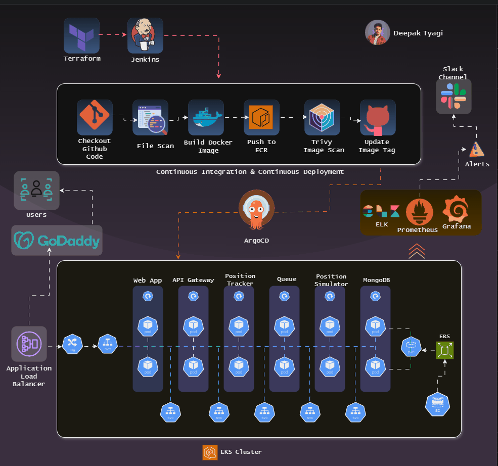

<h3 align="center">Connect with me:</h3>

 
  

    
	
   
    
  

# fleetman-api-gateway

This is not intended to be a full production strength API Gateway. For now it simply serves as a backend facade for the Angular front end to connect to.

Designed to track and simulate truck movements on a map, this project generates truck positions using the Position Simulator microservice, with no real trucks involved. The system not only displays real-time positions but also records the historical paths traveled by the trucks, providing a complete overview of their movements.

- Acts as the entry point for external communication with the microservices.

# Tools and Topologies
In today's fast-paced DevOps world, deploying microservices at scale demands a robust and integrated approach. This guide dives into a production-grade, six-tier microservices architecture deployed on Amazon EKS. 

- **Continuous Integration (CI):** Jenkins for automating build and testing processes.
- **Infrastructure as Code (IaC)**: Terraform for managing and provisioning infrastructure.
- **Continuous Deployment (CD):** ArgoCD for deploying applications continuously and reliably.
- **Monitoring and Observability:** Prometheus and Grafana for metrics and dashboards; ELK stack for centralized logging.
- **Automated Alerts:** Slack notifications for instant alerts on failures, ensuring rapid response.
- **Security and Quality:** SonarQube for static code analysis and Trivy for container image scanning.

- # Fleetman Demo

